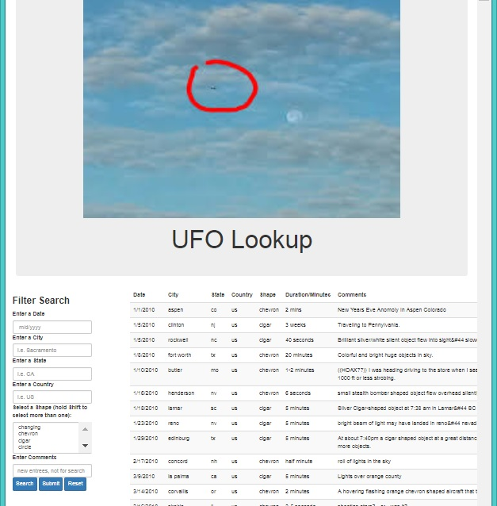
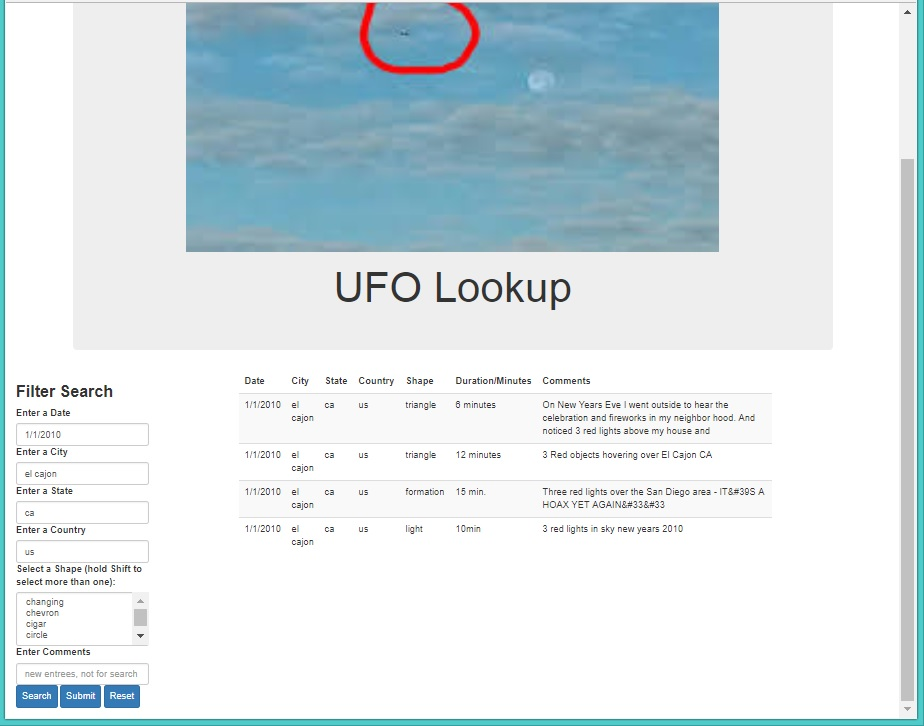
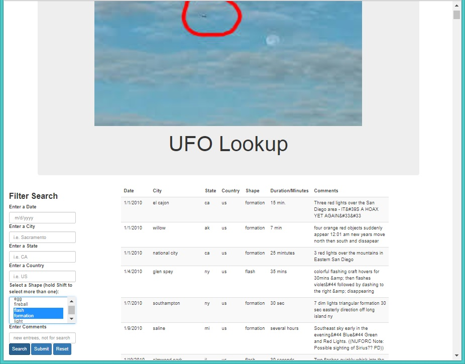

# JavaScript and DOM Manipulation

### Automatic Table and Date Search

Using the [ufo dataset](Data/data.js) provided in the form of a JavaScript object, write code that appends a table to the web page and then adds new rows of data for each UFO sighting. Use only JavaScript, HTML, and CSS.

### Multiple Search Categories

Using multiple `input` tags and/or select dropdowns, write JavaScript code so the user can to set multiple filters and search for UFO sightings. 

### Below are some samples of the Search results.

####Search by Date / City / State:

####Search by Shape:

